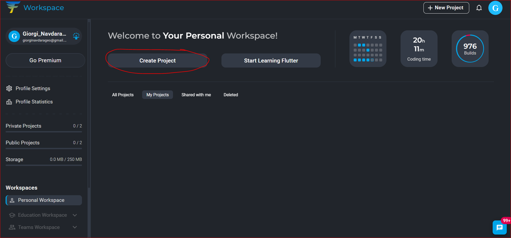
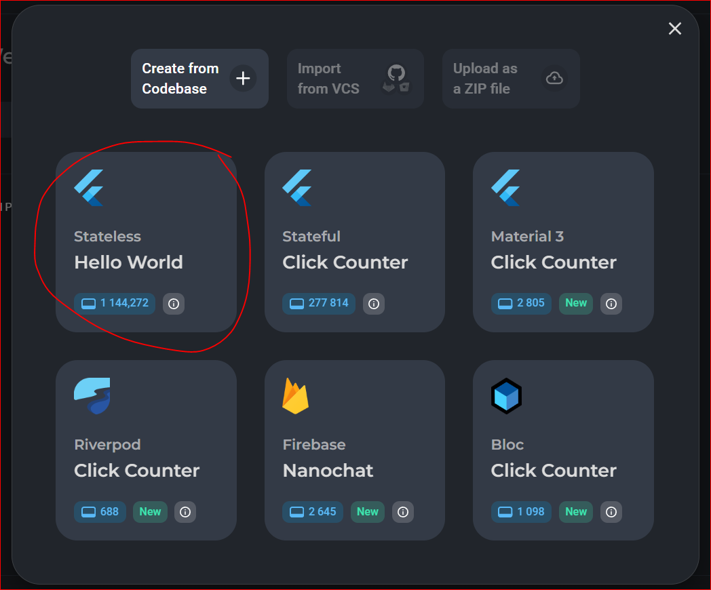
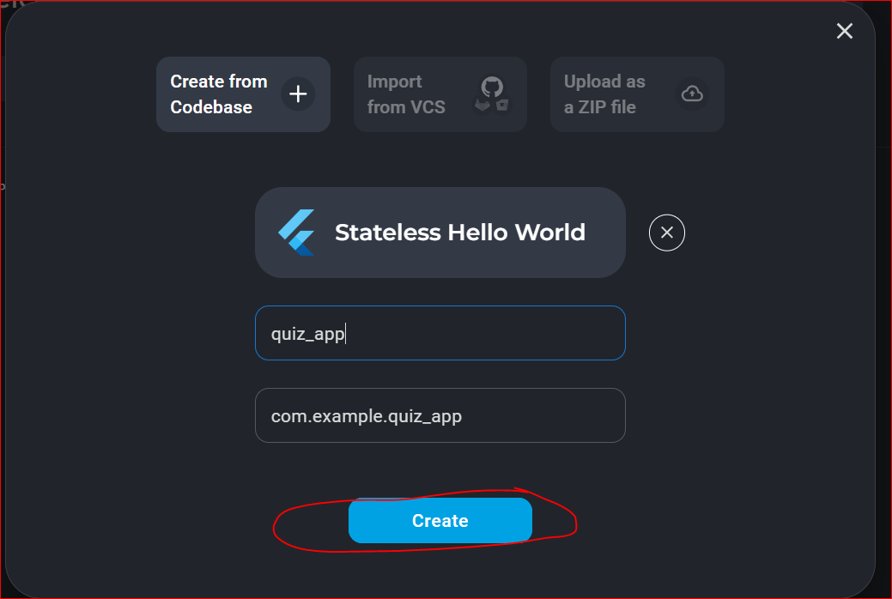
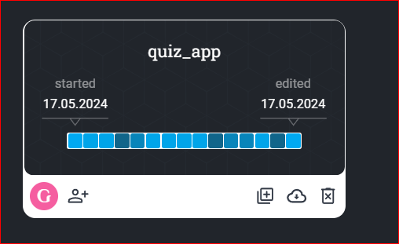
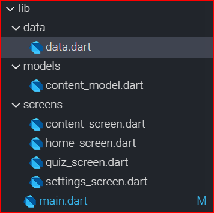
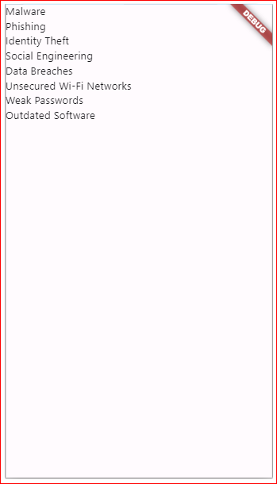
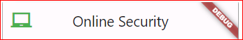
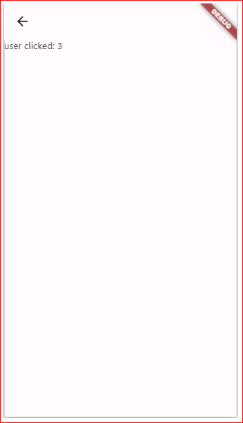
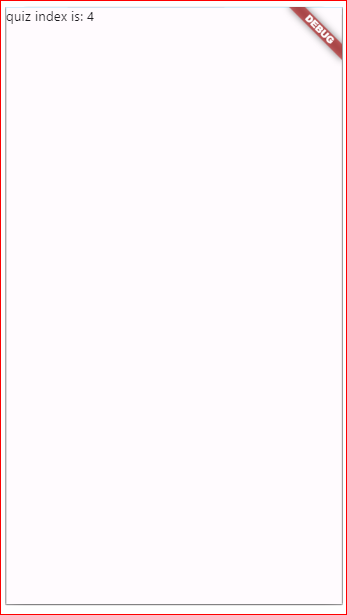
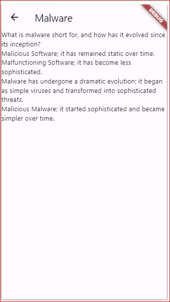

# Quizz App - ნაწილი I

## I - რას გავაკეთებთ?

ჩვენ ავაწყობთ ინფორმაციულ მობაილურის აპლიკაციას ონლაინ უსაფრთხოებაზე. აპლიკაციაში გვექნება კონტენტი სხვადასხვა თემის გარშემო ონლაინ უსაფრთხოებაზე. ყოველი თემის შემდეგ მომხმარებელს შეეძლება გაიაროს მინი ქვიზი განხილულ თემებზე. ქვევით მოცემულია ჩვენი აპლიკაციის სქრინები მოკლე აღწერასთან ერთად:

HomeScreen - მოცემული გვაქვს სია, რომელშიც ჩამოთვლილია ყველა იმ თემის სათაური, რასაც აპლიკაციაში განვიხილავთ.

ContentScreen - მოცემულია ინფორმაცია ერთი კონკრეტული თემის გარშემო ონლაინ უსაფრთხოებაზე.

QuizScreen - მომხმარებელს შეეძლება გაიაროს მინი ქვიზი განვლილ თემაზე.

ResultScreen - მომხმარებელი შეძლებს ნახოს მოგროვებული ქულები ქვიზის შემდეგ

##  II - ვქმნით პროექტს
შევდივართ [Flutlab.io](https://flutlab.io/) პლათფორმაზე ჩვენს ექაუნთზე. შემდეგ create project ღილაკის დახმარებით ვქმნით ახალ პროექტს



ვირჩევთ Hello World template_ს



ვუთითებთ პროექტის სახელს და ვაწვებით create ღილაკს



ბოლოს კი ვირჩევთ ჩვენს მიერ შექმნილ პროექტს Workspace ში



## III - ვქმნით აპლიკაციის ზოგად სტრუქტურას

ახლა მოდით შევქმნათ პროექტის ზოგადი სტრუქტურა: შევმნათ საჭირო ფოლდერები და ფაილები, რომლებიც დაგვეხმარება ჩვენი კოდის სტანდარტების მიხედვით დაყოფაში.

პირველ რიგში შექმენი სურატზე მოცემული ფოლდერები და ფაილები შენი პროექტის lib ფოლდერში: 




## IV - აპლიკაციის ინფორმაციის მოდელირება
სანამ აპლიკაციის ვიზუალურ მხარეზე ვიზრუნებდეთ, მოდით შევქმნათ რამდენიმე კლასი სადაც აღვწერთ იმ ინფორმაციას/ობიექტებს, რომლებიც ჩვენს აპლიკაციაში გამოჩნდება.

content_model.dart ფაილში შევქნათ  კლასი სახელად Chapter :

```dart
class Chapter {
  final String title;
  final List<ChapterParagraph> paragraphs;

  Chapter({
    required this.title,
    required this.paragraphs,
  });
}
```

Chapter კლასი შედგება თავის სათაურისა და ChapterParagraph ობიექტების სიისაგან. ამ ინფორმაციებს კონსტრუქტორში ვითხოვთ პარამეტრების სახით.

და ბოლოს ისევ ამ ფაილში შექმენი კლასი სახელად ChapterParagraph :

```dart
class ChapterParagraph {
  final String paragraphTitle;
  final String paragraph;

  ChapterParagraph({
    required this.paragraphTitle,
    required this.paragraph,
  });
}
```

ეს კლასი აღწერს ერთი თავის ერთ ცალ პარაგრაფს და მის სათაურს.

ობიექტების სტრუქტურა უკვე აღვწერეთ ახლა გადავიდეთ data.dart ფაილში და ამ კლასების დახმარებით შევქმნათ ობიექტები, რომლებიც შეინახავენ ჩვენი აპლიკაციის ინფორმაცაიას.

data.dart ფაილში შევქმენი ცვლადი სახელად appContent, რომელიც საწყის ეტაპზე არანაირ ინფორმაციას არ შეიცავს. ყურადღებით დააკვირდი ამ ცვლადის ზოგად სტრუქტურას.
```dart
import 'package:quiz_app/models/content_model.dart';

final List<Chapter> appContent = [
  Chapter(
    title: '',
    paragraphs: [
      ChapterParagraph(
        paragraphTitle: '',
        paragraph: '',
      ),
      ChapterParagraph(
        paragraphTitle: '',
        paragraph: '',
      ),
      ChapterParagraph(
        paragraphTitle: '',
        paragraph: '',
      ),
    ],
  ),
];

```

 შემდეგ კი იგივე ცვლადი უკვე ინფორმაციით შევსებული შეგიძლია შემდეგ ფაილში ნახო: [data.dart](data.dart) 

 რათქმაუნდა შენს პროექტში შეგიძლია შეიტანო შენთვის სასურველი კონტენტი სამოქალაქო განათლებიდან

##  V - HomeScreen
home_screen.dart ფაილში შექმენი stateless ვიჯეტი სახელად HomeScreen, შემდეგ კი main.dart ფაილში MaterialApp ვიჯეტის home პარამეტრის მნიშვნელობათ გადაეცი HomeScreen კონსტრუქტორი:

საწყის ეტაპზე ჩვენი home_screen.dart ფაილი ასე გამოიყურება:

```dart
import 'package:flutter/material.dart';

class HomeScreen extends StatelessWidget {
  const HomeScreen({Key? key}) : super(key: key);

  @override
  Widget build(BuildContext context) {
    return const Placeholder();
  }
}

```

ხოლო main.dart ფაილი კი ასე:

```dart
import 'package:flutter/material.dart';
import 'package:quiz_app/screens/home_screen.dart';

void main() {
  runApp(const MyApp());
}

class MyApp extends StatelessWidget {
  const MyApp({Key? key}) : super(key: key);

  @override
  Widget build(BuildContext context) {
    return const MaterialApp(
      home: HomeScreen(),
    );
  }
}

```

main.dart ფაილში მიაქციე ყურადღება home_screen.dart ფაილის import ინსტრუქციას. იმ შემთხვევაში თუ შენი პროექტის სახელი განხვავედება ჩემისგან ეს ინსტრუქციაც განსხვავებული იქნება.

ახლა კი HomeScreen ვიჯეტში შევიტანოთ ონლაინ უსაფრთხოებაზე თავების სათაურები ListView ვიჯეტის გამოყენებით. საწყის ეტაპზე გამოვიყენოთ მხოლოდ Text ვიჯეტი სათაურების ვიზუალურად გამოსაჩენად:

```dart
import 'package:flutter/material.dart';
import 'package:quiz_app/data/data.dart';

class HomeScreen extends StatelessWidget {
  const HomeScreen({Key? key}) : super(key: key);

  @override
  Widget build(BuildContext context) {
    return Scaffold(
      body: ListView.builder(
        itemBuilder: (context, index) {
          return Text(appContent[index].title);
        },
        itemCount: appContent.length,
      ),
    );
  }
}

```

როგორც ხედავთ დავამატეთ Scaffold ვიჯეტი და მის body პარამეტრში აღვწერეთ ListView ობიექტი. ListView_ს თითოეული ელემენტი კი არის Text ვიჯეტი.
Text ვიჯეტის მნიშვნელობად ვიყენებთ data.dart ფაილში აღწერილ (რომელიც აუცილებლად უნდა დავაიმპორტოთ) appContent ცვლადს და ინდექსის დახმარებით მოგვაქვს title პარამეტრის მნიშვნელობები

ამის შემდეგ თუკი ჩვენს აპლიკაციას გავუშვებთ ემულატორზე ის ასე გამოიყურება:



სანამ ListView ვიჯეტის ელემენტების ვუზუალზე ვიზრუნებდეთ მოდით დავამატოთ AppBar ვიჯეტი და გამოვაჩინოთ აპლიკაციის სახელიც HomeScreen ვიჯეტში. ამისათვის Scaffold ვიჯეტში დავამატოთ appBar პარამეტრი, რომელიც მნიშვნელობად AppBar ობიექტს ელოდება.

```dart
import 'package:flutter/material.dart';
import 'package:quiz_app/data/data.dart';

class HomeScreen extends StatelessWidget {
  const HomeScreen({Key? key}) : super(key: key);

  @override
  Widget build(BuildContext context) {
    return Scaffold(
      appBar: AppBar(
        leading: const Icon(
          Icons.laptop_chromebook,
          color: Colors.green,
          size: 32,
        ),
        title: const Text('Online Security'),
        centerTitle: true,
      ),
      body: ListView.builder(
        itemBuilder: (context, index) {
          return Text(appContent[index].title);
        },
        itemCount: appContent.length,
      ),
    );
  }
}

```

AppBar ვიჯეტს სამი პარამეტრი გავუწერეთ:
 - leading - მნიშვნელობად გადავეცით Icon ობიექტი, რომელსაც თავის მხრივ გავუწერეთ სურათი/იქონი, ფერი და ზომა
 - title - მნიშვნელობად გადავეცით Text ვიჯეტი, აპლიკაციის სახელით
 - centerTitle - მნიშვნლობად გადავეცით true რის შედეგადაც აპლიკაციის სათაური გაიწერნტრა ჰორიზონტალურად AppBar ვიჯეტში.




 დავუბრუნდეთ ჩვენს ListView_ს ელემენტებს. ყოველთვის კარგი აზრია ეკრანის კომპონენტების ცალცლაკე ვიჯეტებად/ფაილებში დანაწევრება. ამისთვის შეგვიძლია კურსორი გავაჩეროთ itemBuilder პარამეტრის ფუნქციაში არსებულ Text ვიჯეტზე, შემდეგ ctrl + . შორთქათის დახმარებით გამოვიძახოთ დამხმარე ფანჯარა და ავირჩიოთ Extract Widget გამოსულ ფანჯარაში მივუთითოთ ვიჯეტის სახელი: ჩემს შემთხვევაში დავარქვი HomeMenuItem. ამის შემდეგ ჩვენს კოდში ორ ცვლილებას აღმოვაჩენთ.

 1. ფაილის ბოლოში დაემატა ახალი კლასი სახლეად HomeMenuItem. ამ ვიჯეტის build მეთოდში სწორედ ჩვენი Text ვიჯეტი ბრუნდება
 2. itemBuilder პარამეტრში გადაწოდებულ ფუნქციაში ჩვენი Text ვიჯეტი შეიცვალა ახლად შექმნილი HomeMenuItem ვიჯეტის კონსტრუქტორით.

 ```dart
import 'package:flutter/material.dart';
import 'package:quiz_app/data/data.dart';

class HomeScreen extends StatelessWidget {
  const HomeScreen({Key? key}) : super(key: key);

  @override
  Widget build(BuildContext context) {
    return Scaffold(
      appBar: AppBar(
        leading: const Icon(
          Icons.laptop_chromebook,
          color: Colors.green,
          size: 32,
        ),
        title: const Text('Online Security'),
        centerTitle: true,
      ),
      body: ListView.builder(
        itemBuilder: (context, index) {
          return HomeMenuItem();
        },
        itemCount: appContent.length,
      ),
    );
  }
}

class HomeMenuItem extends StatelessWidget {
  const HomeMenuItem({
    super.key,
  });

  @override
  Widget build(BuildContext context) {
    return Text(appContent[index].title);
  }
}

 ```

 ამ ცვლილების შემდეგ ჩვენს კოდში სინტაქსური შეცდომაა. საქმე ისაა, რომ HomeMenuItem იყენებს index ცვლადს რომელიც აღწერილია HomeScreen კლასში.
 ამ პრობლემის გადაჭრა მარტივად შეგვიძლია. HomeMenuItem კლასს დავამატოთ ახალი ცვლადი სახელად index და ეს ინფორმაცია მოვითხოვოთ კონსტრუქტორში. ბოლოს კი HomeMenuItem კონსტუქტორის გამოძახებისას გადავაწოდოთ ეს ინფორმაცია. ამ ცვლილებების შეტანის შემდეგ მთლიანი home_screen.dart ფაილი ასე გამოიყურება:

 ```dart
import 'package:flutter/material.dart';
import 'package:quiz_app/data/data.dart';

class HomeScreen extends StatelessWidget {
  const HomeScreen({Key? key}) : super(key: key);

  @override
  Widget build(BuildContext context) {
    return Scaffold(
      appBar: AppBar(
        leading: const Icon(
          Icons.laptop_chromebook,
          color: Colors.green,
          size: 32,
        ),
        title: const Text('Online Security'),
        centerTitle: true,
      ),
      body: ListView.builder(
        itemBuilder: (context, index) {
          return HomeMenuItem(index: index);
        },
        itemCount: appContent.length,
      ),
    );
  }
}

class HomeMenuItem extends StatelessWidget {
  final int index;
  const HomeMenuItem({
    super.key,
    required this.index,
  });

  @override
  Widget build(BuildContext context) {
    return Text(appContent[index].title);
  }
}

 ```

 და ბოლოს მოდით ეს ვიჯეტი (HomeMenuItem) გავიტანოთ ცალკე ფაილში. lib ფოლდერში დავამატოთ components ფოლდერი. components ფოლდერში კი შევქმნათ ფაილი სახელად home_menu_item.dart გადავაკოპიროთ ჩვენი ვიჯეტი ახლად შექმნილ ფაილში და დავამატოთ import ინსტრუქცია material.dart ფაილის. ასევე დავაიმპორტოთ data.dart ფაილი.
 რაც შეეხება home_screen.dart ფაილს, აქ უნდა დავაიმპორტოთ ახლად შექმნილი home_menu_item.dart ფაილი. ამ ცვლილებების შემდეგ home_menu_item.dart ფაილი ასე გამოიყურება:

 ```dart
import 'package:flutter/material.dart';

import '../data/data.dart';

class HomeMenuItem extends StatelessWidget {
  final int index;
  const HomeMenuItem({
    super.key,
    required this.index,
  });

  @override
  Widget build(BuildContext context) {
    return Text(appContent[index].title);
  }
}

 ```

 ხოლო home_screen.dart ფაილი ასე:

 ```dart
import 'package:flutter/material.dart';
import 'package:quiz_app/data/data.dart';

import '../components/home_menu_item.dart';

class HomeScreen extends StatelessWidget {
  const HomeScreen({Key? key}) : super(key: key);

  @override
  Widget build(BuildContext context) {
    return Scaffold(
      appBar: AppBar(
        leading: const Icon(
          Icons.laptop_chromebook,
          color: Colors.green,
          size: 32,
        ),
        title: const Text('Online Security'),
        centerTitle: true,
      ),
      body: ListView.builder(
        itemBuilder: (context, index) {
          return HomeMenuItem(index: index);
        },
        itemCount: appContent.length,
      ),
    );
  }
}

 ```

 ამ ცვლილებას სამი დადებითი მხარე აქვს. პირველ რიგში კოდი დავყავით შედარებით პატარა ზომის მარტივად სამართავ ფაილებად. მეორე პლიუსი აპლიკაციის პერფორმანსთან არის კავშირში და მომდევნო გაკვეთილებში განვიხილავთ. მესამე კი ის არის რომ ამავე ვიჯეტის გამოყენება უკვე აპლიკაციის ნებისმიერ ნაწილში შეგვიძლია იმდენჯერ რამდენჯერაც დაგვჭირდება.

 ახლა კი გადავინაცვლოთ HomeMenuItem ვიჯეტში და დავხვეწოთ ის ვიზუალურად. პირველ რიგში Text ვიჯეტი ჩავსვათ ListTile ვიჯეტში. child პარამეტრი ამ ვიჯეტს არ აქვს და პარამეტრის სახელი title_ით შევცვალოთ. ListTile ვიჯეტი თავის მხრივ ჩავსვათ Card ვიჯეტში და გავუწეროთ margin პარამეტრი. ბოლოს კი Card ვიჯეტი ჩავსვათ GestureDetector ვიჯეტში, გავუწეროთ onTap პარამეტრი სადაც მომხმარებელს ContentScreen ვიჯეტში გადავიყვანთ

 ```dart
import 'package:flutter/material.dart';

import '../data/data.dart';
import '../screens/content_screen.dart';

class HomeMenuItem extends StatelessWidget {
  final int index;
  const HomeMenuItem({
    super.key,
    required this.index,
  });

  @override
  Widget build(BuildContext context) {
    return GestureDetector(
      onTap: () {
        Navigator.of(context).push(
          MaterialPageRoute(
            builder: (context) {
              return ContentScreen();
            },
          ),
        );
      },
      child: Card(
        margin: const EdgeInsets.symmetric(
          horizontal: 16,
          vertical: 8,
        ),
        child: ListTile(
          title: Text(appContent[index].title),
        ),
      ),
    );
  }
}

 ```

## VI - ContentScreen
content_screen.dart ფაილის საწყისი კოდი ასე გამოიყურება:
```dart
import 'package:flutter/material.dart';

class ContentScreen extends StatelessWidget {
  const ContentScreen({Key? key}) : super(key: key);

  @override
  Widget build(BuildContext context) {
    return const Placeholder();
  }
}

```

ამ ეკრანზე აუცილებლად დაგვჭირდება იმ სათაურის ინდექსი, რომელსაც მომხმარებელმა დააჭირა ამიტომ პირველ რიგში მივიღოთ ეს ინდექსი კონსტრუქტორში, შემდეგ კი Text ვიჯეტის დახმარებით გამოვაჩინოთ ეკრანზე.

```dart
import 'package:flutter/material.dart';

class ContentScreen extends StatelessWidget {
  final int chapterIndex;
  const ContentScreen({
    Key? key,
    required this.chapterIndex,
  }) : super(key: key);

  @override
  Widget build(BuildContext context) {
    return Scaffold(
      appBar: AppBar(),
      body: Text('user clicked: $chapterIndex'),
    );
  }
}
```

რათქმაუნდა HomeMenuItem ვიჯეტში ContentScreen ობიექტის შექმნისას ინდექსის პარამეტრი უნდა გადავაწოდოთ: 

```dart
onTap: () {
  Navigator.of(context).push(
    MaterialPageRoute(
      builder: (context) {
        return ContentScreen(
          chapterIndex: index,
        );
      },
    ),
  );
},
```

ამის შემდეგ ემულატორში ContentScreen ასე გამოიყურება:



როგორც data.dart ფაილში ნახავ თითოეულ თავს აქვს მთავარი სათაური, ასევე ოთხი პარაგრაფი სათაურებით. მთავარ სათაურს გამოვაჩენთ AppBar ვიჯეტში, ხოლო პარაგრაფებისათვის შევქმნით ListView ობიექტს. ListView ობიექტის თითოეულ ელემენტს კი ცალკე ვიჯეტის სახით components ფოლდერში გავიტანთ.

ჯერჯერობით ContentScreen ვიჯეტი ასე გამოიყურება:

```dart
import 'package:flutter/material.dart';
import 'package:quiz_app/data/data.dart';
import 'package:quiz_app/models/content_model.dart';

class ContentScreen extends StatelessWidget {
  final int chapterIndex;
  const ContentScreen({
    Key? key,
    required this.chapterIndex,
  }) : super(key: key);

  @override
  Widget build(BuildContext context) {
    final String chapterTitle = appContent[chapterIndex].title;
    final List<ChapterParagraph> paragraphs = appContent[chapterIndex].paragraphs;

    return Scaffold(
      appBar: AppBar(
        title: Text(chapterTitle),
        centerTitle: true,
      ),
      body: ListView.builder(
        itemBuilder: (context, index) {
          return Column(
            children: [
              Text(paragraphs[index].paragraphTitle),
              const Divider(),
              Text(paragraphs[index].paragraph),
            ],
          );
        },
        itemCount: paragraphs.length,
      ),
    );
  }
}

```
build მეთოდის დასაწყისში შევქმენით ორი ცვლადი:
 - chapterTitle - ინახავს კონკრეტული თავის სათაურს
 - paragraphs - ინახავს პარაგრაფების სიას (ChapterParagraph ტიპის ობიექტებს)

თავის სათაურს AppBar_ში ვაჩენთ, პარაგრაფებს კი ListView ვიჯეტში.
ახლა მოდით Column ვიჯეტი რომელიც ListView_ს ერთი ელემენტია, ცალკე ფაილში გავიტანოთ როგორც stateLess ვიჯეტი.
ამისთვის გამოიყენე ctrl + . დამხმარე ფანჯარა Column ვიჯეტზე, შემდეგ Extract Widget. ამის შემდეგ შეურჩიე სახელი ახალ ვიჯეტს, ჩემს შემთხვევაში ვიჯეტს დავარქვი ParagraphItem. სრული ფაილი ასე გამოიყურება:

```dart
import 'package:flutter/material.dart';
import 'package:quiz_app/data/data.dart';
import 'package:quiz_app/models/content_model.dart';

class ContentScreen extends StatelessWidget {
  final int chapterIndex;
  const ContentScreen({
    Key? key,
    required this.chapterIndex,
  }) : super(key: key);

  @override
  Widget build(BuildContext context) {
    final String chapterTitle = appContent[chapterIndex].title;
    final List<ChapterParagraph> paragraphs =
        appContent[chapterIndex].paragraphs;

    return Scaffold(
      appBar: AppBar(
        title: Text(chapterTitle),
        centerTitle: true,
      ),
      body: ListView.builder(
        itemBuilder: (context, index) {
          return ParagraphItem(paragraphs: paragraphs);
        },
        itemCount: paragraphs.length,
      ),
    );
  }
}

class ParagraphItem extends StatelessWidget {
  const ParagraphItem({
    super.key,
    required this.paragraphs,
  });

  final List<ChapterParagraph> paragraphs;

  @override
  Widget build(BuildContext context) {
    return Column(
      children: [
        Text(paragraphs[index].paragraphTitle),
        const Divider(),
        Text(paragraphs[index].paragraph),
      ],
    );
  }
}

```


ვიჯეტის შექმნისას Flutter_მა ავტომატურად შექმნა paragraphs ცვლადი და დაამატა კონსტრუქტორის პარამეტრი, თუმცა იგივე არ გაუკეთებია ინდექსისათვის, ამიტომ მოდით ეს ჩვენით გავაკეთოთ:

```dart

class ParagraphItem extends StatelessWidget {
  const ParagraphItem({
    super.key,
    required this.paragraphs,
    required this.index,
  });

  final List<ChapterParagraph> paragraphs;
  final int index;

  @override
  Widget build(BuildContext context) {
    return Column(
      children: [
        Text(paragraphs[index].paragraphTitle),
        const Divider(),
        Text(paragraphs[index].paragraph),
      ],
    );
  }
}


```

ContentScreen ვიჯეტში არ დაგავიწყდეს index_ის გადმოწოდება:

```dart
  return ParagraphItem(index: index,paragraphs: paragraphs);
```

ახლა ისღა დაგვრჩენია ParagraphItem ვიჯეტი გავიტანოთ ცალკე ფაილში. ამისთვის components ფოლდერში დაამატა ახალი ფაილი სახელად paragraph_item.dart. გადაიტანე ParagraphItem ვიჯეტი ამ ფაილში და დაამატე საჭირო import ინსტრუქციები ორივე ფაილში.

მოდით ParagraphItem ვიჯეტში დავამატოთ მცირე ვიზუალური ეფექტები. გამოვყოთ პარაგრაფის სათაური პარაგრაფისგან, და ასევე მთლიენი Column ვიჯეტი დავაშოროთ ეკრანის კიდეებს.

```dart
import 'package:flutter/material.dart';

import '../models/content_model.dart';

class ParagraphItem extends StatelessWidget {
  const ParagraphItem({
    super.key,
    required this.paragraphs,
    required this.index,
  });

  final List<ChapterParagraph> paragraphs;
  final int index;

  @override
  Widget build(BuildContext context) {
    return Container(
      margin: const EdgeInsets.symmetric(horizontal: 16, vertical: 8),
      child: Column(
        children: [
          Text(paragraphs[index].paragraphTitle,
              style: const TextStyle(
                fontSize: 18,
                fontWeight: FontWeight.bold,
              )),
          const Divider(),
          Text(paragraphs[index].paragraph),
        ],
      ),
    );
  }
}

```

ამ ცვლილებების შემდეგ ჩვენი ContentScreen ეკრანი ასე გამოიყურება:


ბოლოს ContentScreen ვიჯეტში, Scaffold ვიჯეტის პარამეტრი floatingActionButton  დავამატოთ, FloatingActionButton ვიჯეტი გამოიყენება ეკრანზე მთავარი/ყველაზე მნიშვნელოვანი ფუნქციის შესასრულებლად. ჩვენს შემთხვევაში ეს იქნება კონკრეტული თავის შესახებ ქვიზ ეკრანის გახსნა. FloatingActionButton ვიჯეტს ორ პარამეტრს გადავაწოდებთ:
- onPressed - გადავაწოდებთ ფუნქციას, რომელიც მოახდენს ნავიგაციას
- child - გამოვიყენებთ Icon ვიჯეტს.

საბოლოო ჯამში ContentScreen ვიჯეტის კოდი ასე გამოიყურება: 

```dart

import 'package:flutter/material.dart';
import 'package:quiz_app/data/data.dart';
import 'package:quiz_app/models/content_model.dart';
import 'package:quiz_app/screens/quiz_screen.dart';

import '../components/paragraph_item.dart';

class ContentScreen extends StatelessWidget {
  final int chapterIndex;
  const ContentScreen({
    Key? key,
    required this.chapterIndex,
  }) : super(key: key);

  @override
  Widget build(BuildContext context) {
    final String chapterTitle = appContent[chapterIndex].title;
    final List<ChapterParagraph> paragraphs =
        appContent[chapterIndex].paragraphs;

    return Scaffold(
      appBar: AppBar(
        title: Text(chapterTitle),
        centerTitle: true,
      ),
      floatingActionButton: FloatingActionButton(
        child: const Icon(Icons.play_arrow),
        onPressed: () {
          Navigator.of(context).push(MaterialPageRoute(
            builder: (context) {
              return const QuizScreen();
            },
          ));
        },
      ),
      body: ListView.builder(
        itemBuilder: (context, index) {
          return ParagraphItem(index: index, paragraphs: paragraphs);
        },
        itemCount: paragraphs.length,
      ),
    );
  }
}

```
ხოლო ვიზუალურად ასე:


!!!QuizScreen ვიჯეტი შენს პროექტში ჯერ არ იქნება!!!

## VII - QuizScreen
ჩვენი აპლიკაციის ძირითადი ფუნქციონალის ბოლო ეკრანზეც გადავედით!
quiz_screen.dart ფაილში შექმენი stateFul ვიჯეტი და დაარქვი მას QuizScreen.
ამ ვიჯეტშიც გვჭირდება თავის ინდექსი, მოვითხოვოთ ის კონსტრუქტორში და შევინახოთ ცვლადში სახელად quizIndex. ამ ინფორმაციის გამოყენებას build მეთოდში ჩვენ widget ობიექტის დახმარებით შევძლებთ

```dart
import 'package:flutter/material.dart';

class QuizScreen extends StatefulWidget {
  const QuizScreen({
    Key? key,
    required this.quizIndex,
  }) : super(key: key);
  final int quizIndex;

  @override
  State<QuizScreen> createState() => _QuizScreenState();
}

class _QuizScreenState extends State<QuizScreen> {
  @override
  Widget build(BuildContext context) {
    return Scaffold(
      body: Text('quiz index is: ${widget.quizIndex}'),
    );
  }
}

```

ContentScreen ვიჯეტში, QuizScreen ობიექტის შექმნისას არ დაგავიწყდეს ინდექსის გადმოწოდება:

```dart
  return QuizScreen(quizIndex: chapterIndex,);
```

ამის შემდეგ FloatingActionButton ვიჯეტზე დაჭერისას ემულატორში გამოჩნდება ჩვენი QuizScreen ვიჯეტი.



სანამ QuizScreen ვიჯეტის ვიზუალურ მხარეზე ვიზრუნებდით მოდით დავამატოთ შესაბამისი მოდელი ჩვენს პროექტში და შევიტანოთ კითხვები data.dart ფაილში
models ფოლდერში დაამატე quiz_model.dart ფაილი და შექმენი QuizModel კლასი

```dart
class QuizModel {
  final String question;
  final List<String> answers;
  final String correctAnswer;

  QuizModel({
    required this.question,
    required this.answers,
    required this.correctAnswer,
  });
}

```

ეს მოდელი შედგება:
- ქვიზის კითხვა
- სავარაუდო პასუხების სია
- სწორი პასუხი

content_model.dart ფაილში, Chapter კლასს დავამატოთ ერთი ახალი ცვლადი რომლის ტიპიც იქნება List<QuizModel>

```dart
class Chapter {
  final String title;
  final List<ChapterParagraph> paragraphs;
  final List<QuizModel> questions;
  Chapter({
    required this.title,
    required this.paragraphs,
    required this.questions,
  });
}

```

ამის შემდეგ data.dart ფაილში გვექნება სინტაქსური შეცდომები, რადგან Chapter კონსტრუქტორი ელოდება სახელიან პარამეტრს questions. data.dart ფაილის განახლებული ვერსია შეგიძლია ნახო [data_v2.dart](data_v2.dart) 

ამის შემდეგ QuizScreen ვიჯეტში უკვე შეგვიძლია გამოვიყენოთ ეს ინფორმაცია.

საწყის ეტაპზე QuizScreen ვიჯეტის კოდი ასე გამოიყურება:

```dart
import 'package:flutter/material.dart';
import 'package:quiz_app/data/data.dart';

class QuizScreen extends StatefulWidget {
  const QuizScreen({
    Key? key,
    required this.quizIndex,
  }) : super(key: key);
  final int quizIndex;

  @override
  State<QuizScreen> createState() => _QuizScreenState();
}

class _QuizScreenState extends State<QuizScreen> {
  final questionIndex = 0;
  @override
  Widget build(BuildContext context) {
    final chapterData = appContent[widget.quizIndex];
    return Scaffold(
      appBar: AppBar(
        title: Text(chapterData.title),
      ),
      body: Column(
        children: [
          Text(chapterData.questions[questionIndex].question),
          Expanded(
            child: ListView.builder(
              itemBuilder: (context, index) {
                return Text(
                  chapterData.questions[questionIndex].answers[index],
                );
              },
              itemCount: chapterData.questions[questionIndex].answers.length,
            ),
          )
        ],
      ),
    );
  }
}

```

ხოლო QuizScreen ვიჯეტის ვიზუალი კი ასე:



როგორც ხედავ გვაქვს Column ვიჯეტი, რომელშიც:
- Text ვიჯეტში გვაქვს კითხვა მოცემული
- ListView_ს დახმარებით ვაგენერირებთ 4 ცალ Text ვიჯეტს (ჯერჯერობით) სავარაუდო პასუხებისათვის

ქვევით მოცემულია QuizScreen ვიჯეტის კოდი ამ ეტაპზე ჩემს მიერ არჩეული დიზაინით, ვიჯეტების დიზაინი რათქმაუნდა შეგიძლიათ გადააკეთოთ თქვენი გემოვნებით. 

```dart
import 'package:flutter/material.dart';
import 'package:quiz_app/data/data.dart';

class QuizScreen extends StatefulWidget {
  const QuizScreen({
    Key? key,
    required this.quizIndex,
  }) : super(key: key);
  final int quizIndex;

  @override
  State<QuizScreen> createState() => _QuizScreenState();
}

class _QuizScreenState extends State<QuizScreen> {
  int questionIndex = 0;
  final List<String> answerLetters = [
    'A.',
    'B.',
    'C.',
    'D.',
  ];

  final List<Color> answerColors = [
    Colors.grey.shade100,
    Colors.grey.shade100,
    Colors.grey.shade100,
    Colors.grey.shade100,
  ];
  @override
  Widget build(BuildContext context) {
    final chapterData = appContent[widget.quizIndex];
    return Scaffold(
      appBar: AppBar(
        title: Text(chapterData.title),
      ),
      body: Container(
        margin: const EdgeInsets.all(16),
        child: Column(
          children: [
            Text(
              chapterData.questions[questionIndex].question,
              textAlign: TextAlign.center,
              style: const TextStyle(
                fontSize: 18,
                fontWeight: FontWeight.bold,
              ),
            ),
            const Divider(),
            Expanded(
              child: ListView.builder(
                itemCount: chapterData.questions[questionIndex].answers.length,
                itemBuilder: (context, index) {
                  return Card(
                    color: answerColors[index],
                    margin: const EdgeInsets.symmetric(vertical: 8),
                    child: Padding(
                      padding: const EdgeInsets.symmetric(
                        horizontal: 16,
                        vertical: 8,
                      ),
                      child: Row(
                        children: [
                          Text(
                            answerLetters[index],
                            style: const TextStyle(
                              fontSize: 30,
                              fontWeight: FontWeight.bold,
                            ),
                          ),
                          const SizedBox(
                            width: 12,
                          ),
                          Expanded(
                            child: Text(
                              chapterData
                                  .questions[questionIndex].answers[index],
                            ),
                          ),
                        ],
                      ),
                    ),
                  );
                },
              ),
            ),
            TextButton(
              onPressed: () {},
              child: Text('Next'),
            ),
          ],
        ),
      ),
    );
  }
}

```

ახლა კი მომხმარებელს საშვალება მივცეთ, რომ აირჩიოს სასურველი პასუხი და გადავიდეს შემდეგ კითხვაზე. პირველ რიგში Card ვიჯეტი (ვიჯეტი რომელიც მოიცავს სავარაუდო პასუხს / ListView ვიჯეტის ელემენტი) ჩავსვათ GestureDetector და გავუწეროთ onTap პარამეტრის მნიშვნელობად ცარიელი ანონიმური ფუნქცია.
build მეთოდის ზემოთ დავამატოთ ფუნქცია სახელად checkAnswer:

```dart
void checkAnswer(int userChoise) {
    final currentQuestion =
        appContent[widget.quizIndex].questions[questionIndex];
    if (currentQuestion.answers[userChoise] == currentQuestion.correctAnswer) {
      setState(() {
        answerColors[userChoise] = Colors.green;
      });
    } else {
      setState(() {
        answerColors[userChoise] = Colors.red;
      });
    }
  }
```

შემდეგ კი გამოვიძახოთ ეს ფუნქცია GestureDetector ვიჯეტის onTap ფუნქციაში:

```dart
    onTap: () {
      checkAnswer(index);
    },
```

თუ კი აპლიკაციას გატესტავ ემულატორში აღმოაჩენ, რომ სწორი პასუხის არჩევისას პასუხის შესაბამისი ვიჯეტი მწვანდწება, არასწორი პასუხისას კი წითლდება. 
ახლა კი next ღილაკზე დაჭერისას უბრალოდ გავზარდოდ questionIndex ცვლადის მნიშნველობა setState ფუნქციაში. რაც ავტომატურად გამოიწვევს შემდეგი კითხვის გამოჩენას ეკრანზე. ოღონდ რამდენიმე რამის გათვალისწინება მოგვიწევს.

1. Answer ვიჯეტების ფერი უნდა დავაბრუნოთ default მნიშვნოლობაზე
2. მხოლოდ იმ შემთხვევაში უნდა გადავიდეთ შემდეგ კითხვაზე თუ კი შემდეგი კითხვა არსებობს.

```dart

  void nextQuestion() {
    int questionCount = appContent[widget.quizIndex].questions.length;
    if (questionIndex < questionCount - 1) {
      setState(() {
        questionIndex++;
        answerColors.clear();
        answerColors.addAll([
          Colors.grey.shade100,
          Colors.grey.shade100,
          Colors.grey.shade100,
          Colors.grey.shade100,
        ]);
      });
    }
  }

```

გამოიძახე ეს ფუნქცია Next ღილაკის onPressed პარამეტრში:

```dart
  TextButton(
    onPressed: nextQuestion,
    child: Text('Next'),
  ),

```

თუ კი აპლიკაციას გატესტავ აღმოაჩენ, რომ მომხმარებელს უკვე შეუძლია პასუხის გაცემა და იმის ნახვა სწორი იყო თუ არასწორი პასუხი, ასევე მომხმარებელს საშვალება აქვს გადავიდეს შემდეგ ეკრანზე.

ბოლოს შეგვიძლია შევქმნათ ცვლადი მომხმარებლის მიერ მოგროვილი სწორი პასუხების აღსანიშნავად და ყოველთვის როდესაც მომხმარებელი სწორად გასცემს კითხვას პასუხს გავზარდოთ ამ ცვლადის მნიშნელობა. კითხვების ამოწურვის შემდეგ კი მომხმარებელი გადავიყვანოთ ResultScreen_ზე სადაც მის მიერ მოგროვებული ქულები გამოჩნდება.

ამ ცვლილებების შემდეგ QuizScreen ვიჯეტის კოდი ასე გამოიყურება:

```dart
import 'package:flutter/material.dart';
import 'package:quiz_app/data/data.dart';
import 'package:quiz_app/screens/result_screen.dart';

class QuizScreen extends StatefulWidget {
  const QuizScreen({
    Key? key,
    required this.quizIndex,
  }) : super(key: key);
  final int quizIndex;

  @override
  State<QuizScreen> createState() => _QuizScreenState();
}

class _QuizScreenState extends State<QuizScreen> {
  int questionIndex = 0;
  int points = 0;
  final List<String> answerLetters = [
    'A.',
    'B.',
    'C.',
    'D.',
  ];

  final List<Color> answerColors = [
    Colors.grey.shade100,
    Colors.grey.shade100,
    Colors.grey.shade100,
    Colors.grey.shade100,
  ];

  void checkAnswer(int userChoise) {
    final currentQuestion =
        appContent[widget.quizIndex].questions[questionIndex];
    if (currentQuestion.answers[userChoise] == currentQuestion.correctAnswer) {
      setState(() {
        answerColors[userChoise] = Colors.green;
        points++;
      });
    } else {
      setState(() {
        answerColors[userChoise] = Colors.red;
      });
    }
  }

  void nextQuestion() {
    int questionCount = appContent[widget.quizIndex].questions.length;
    if (questionIndex < questionCount - 1) {
      setState(() {
        questionIndex++;
        answerColors.clear();
        answerColors.addAll([
          Colors.grey.shade100,
          Colors.grey.shade100,
          Colors.grey.shade100,
          Colors.grey.shade100,
        ]);
      });
    } else {
      Navigator.of(context).push(MaterialPageRoute(
        builder: (context) {
          return ResultScreen(points: points);
        },
      ));
    }
  }

  @override
  Widget build(BuildContext context) {
    final chapterData = appContent[widget.quizIndex];
    return Scaffold(
      appBar: AppBar(
        title: Text(chapterData.title),
      ),
      body: Container(
        margin: const EdgeInsets.all(16),
        child: Column(
          children: [
            Text(
              chapterData.questions[questionIndex].question,
              textAlign: TextAlign.center,
              style: const TextStyle(
                fontSize: 18,
                fontWeight: FontWeight.bold,
              ),
            ),
            const Divider(),
            Expanded(
              child: ListView.builder(
                itemCount: chapterData.questions[questionIndex].answers.length,
                itemBuilder: (context, index) {
                  return GestureDetector(
                    onTap: () {
                      checkAnswer(index);
                    },
                    child: Card(
                      color: answerColors[index],
                      margin: const EdgeInsets.symmetric(vertical: 8),
                      child: Padding(
                        padding: const EdgeInsets.symmetric(
                          horizontal: 16,
                          vertical: 8,
                        ),
                        child: Row(
                          children: [
                            Text(
                              answerLetters[index],
                              style: const TextStyle(
                                fontSize: 30,
                                fontWeight: FontWeight.bold,
                              ),
                            ),
                            const SizedBox(
                              width: 12,
                            ),
                            Expanded(
                              child: Text(
                                chapterData
                                    .questions[questionIndex].answers[index],
                              ),
                            ),
                          ],
                        ),
                      ),
                    ),
                  );
                },
              ),
            ),
            TextButton(
              onPressed: nextQuestion,
              child: Text('Next'),
            ),
          ],
        ),
      ),
    );
  }
}

```

ხოლო ResultScreen ვიჯეტი კი ასე:

```dart
import 'package:flutter/material.dart';

class ResultScreen extends StatelessWidget {
  const ResultScreen({Key? key, required this.points}) : super(key: key);
  final int points;
  @override
  Widget build(BuildContext context) {
    return Scaffold(
      body: Center(
        child: Text(
          'You scored: $points',
          style: TextStyle(fontSize: 22),
        ),
      ),
    );
  }
}

```

აპლიკაციაში თითქმის ყველაფერი გამართულად მუშაობს. ერთადერთი პრობლემა გვაქვს, როდესაც მომხმარებელი პასუხს აირჩევს მას სხვა პასუხების არჩევაც შეუძლია. ამის მოგვარება მარტივად შეგვიძლია შევქმნათ ცვლადი სახელად alareadyAnswered, default მნიშნველობით false. როგორც კი მომხმარებელი ერთერთ პასუხს აირჩევს შევცვალოთ ამ ცვლადის მნიშვნელობა true_თი. შემდეგ კითხვაზე გადასვლისას კი დავუბრუნოთ default მნიშვნელობა. ბოლოს კი მთლიანი checkAnswer ფუნქციის ტანი ჩავსვათ if _ში და მხოლოდ იმ შემთხვევაში შევასრულოთ მასში მოთავსებული ინსტრუქციები, თუ კი მომხმარებელს ჯერ არ აურჩევია  პასუხი.


QuizScreen ვიჯეტის საბოლოო კოდი ასე გამოიყურება:

```dart
import 'package:flutter/material.dart';
import 'package:quiz_app/data/data.dart';
import 'package:quiz_app/screens/result_screen.dart';

class QuizScreen extends StatefulWidget {
  const QuizScreen({
    Key? key,
    required this.quizIndex,
  }) : super(key: key);
  final int quizIndex;

  @override
  State<QuizScreen> createState() => _QuizScreenState();
}

class _QuizScreenState extends State<QuizScreen> {
  int questionIndex = 0;
  int points = 0;
  bool alreadyAnswered = false;
  final List<String> answerLetters = [
    'A.',
    'B.',
    'C.',
    'D.',
  ];

  final List<Color> answerColors = [
    Colors.grey.shade100,
    Colors.grey.shade100,
    Colors.grey.shade100,
    Colors.grey.shade100,
  ];

  void checkAnswer(int userChoise) {
    if (!alreadyAnswered) {
      setState(() {
        alreadyAnswered = true;
      });
      final currentQuestion =
          appContent[widget.quizIndex].questions[questionIndex];
      if (currentQuestion.answers[userChoise] ==
          currentQuestion.correctAnswer) {
        setState(() {
          answerColors[userChoise] = Colors.green;
          points++;
        });
      } else {
        setState(() {
          answerColors[userChoise] = Colors.red;
        });
      }
    }
  }

  void nextQuestion() {
    int questionCount = appContent[widget.quizIndex].questions.length;
    setState(() {
      alreadyAnswered = false;
    });
    if (questionIndex < questionCount - 1) {
      setState(() {
        questionIndex++;
        answerColors.clear();
        answerColors.addAll([
          Colors.grey.shade100,
          Colors.grey.shade100,
          Colors.grey.shade100,
          Colors.grey.shade100,
        ]);
      });
    } else {
      Navigator.of(context).push(MaterialPageRoute(
        builder: (context) {
          return ResultScreen(points: points);
        },
      ));
    }
  }

  @override
  Widget build(BuildContext context) {
    final chapterData = appContent[widget.quizIndex];
    return Scaffold(
      appBar: AppBar(
        title: Text(chapterData.title),
      ),
      body: Container(
        margin: const EdgeInsets.all(16),
        child: Column(
          children: [
            Text(
              chapterData.questions[questionIndex].question,
              textAlign: TextAlign.center,
              style: const TextStyle(
                fontSize: 18,
                fontWeight: FontWeight.bold,
              ),
            ),
            const Divider(),
            Expanded(
              child: ListView.builder(
                itemCount: chapterData.questions[questionIndex].answers.length,
                itemBuilder: (context, index) {
                  return GestureDetector(
                    onTap: () {
                      checkAnswer(index);
                    },
                    child: Card(
                      color: answerColors[index],
                      margin: const EdgeInsets.symmetric(vertical: 8),
                      child: Padding(
                        padding: const EdgeInsets.symmetric(
                          horizontal: 16,
                          vertical: 8,
                        ),
                        child: Row(
                          children: [
                            Text(
                              answerLetters[index],
                              style: const TextStyle(
                                fontSize: 30,
                                fontWeight: FontWeight.bold,
                              ),
                            ),
                            const SizedBox(
                              width: 12,
                            ),
                            Expanded(
                              child: Text(
                                chapterData
                                    .questions[questionIndex].answers[index],
                              ),
                            ),
                          ],
                        ),
                      ),
                    ),
                  );
                },
              ),
            ),
            TextButton(
              onPressed: nextQuestion,
              child: Text('Next'),
            ),
          ],
        ),
      ),
    );
  }
}

```

აპლიკაციაში კიდევ ბევრი რამის დამატება/შეცვლა შეგვიძლია, თუმცა ეს გაკვეთილი ძალიან დიდი ზომისაა უკვე, შესაბამისად ახალ ფუნქციონალებისა და აპლიკაციის დიზაინის გაუმჯობესებაზე შემდეგი გაკვეთილებისთვის შემოვინახოთ

P.s ნებისმიერი კითხივს, ან გაკვეთილში რაიმე ხარვეზის აღმოჩენისას გთხოვთ აუცილებლად მომწეროთ <3